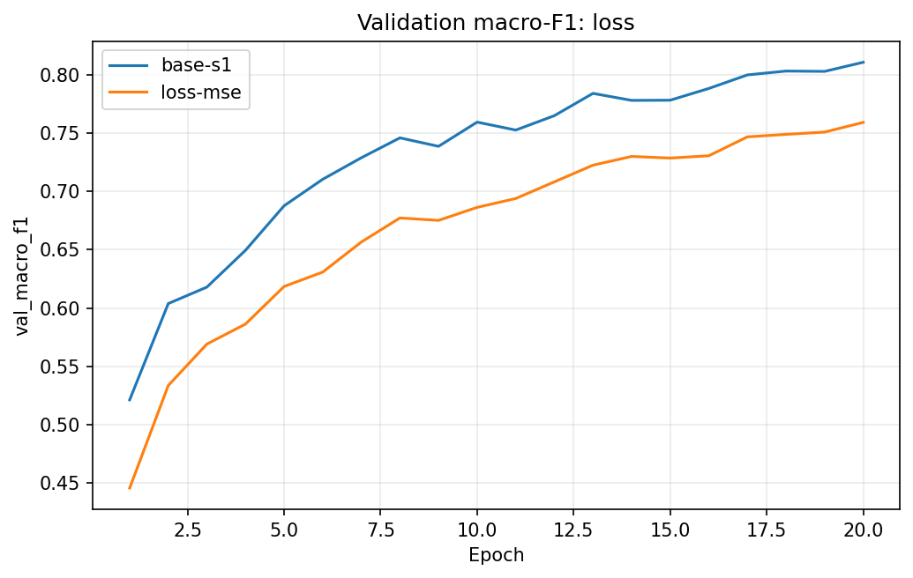
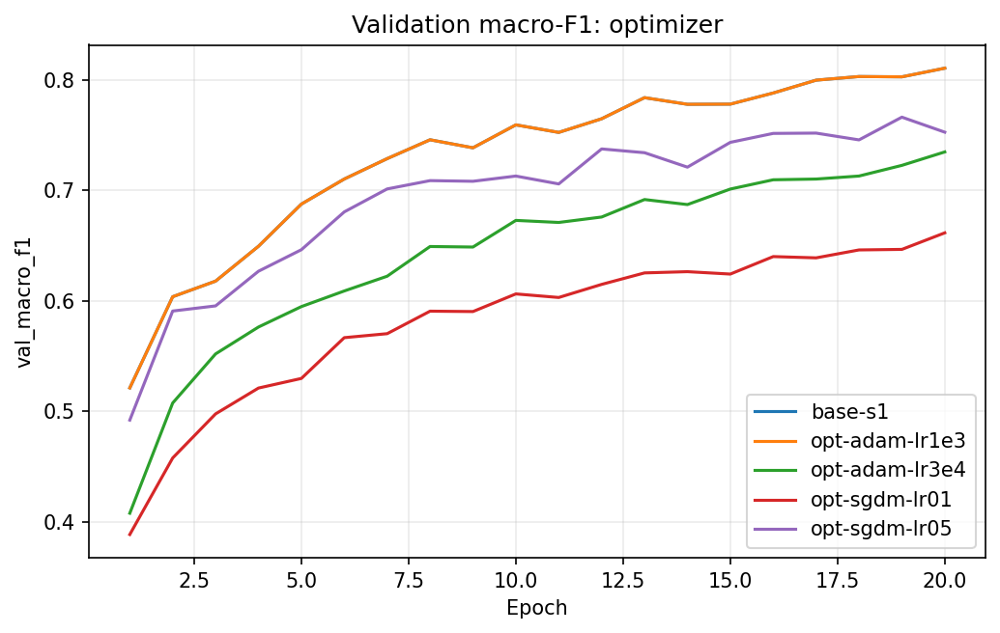
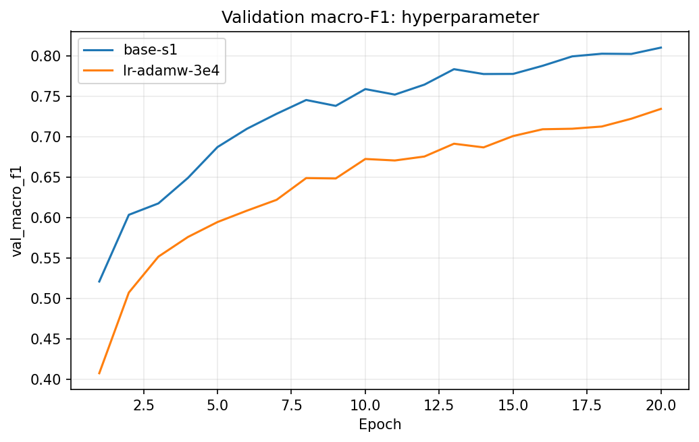
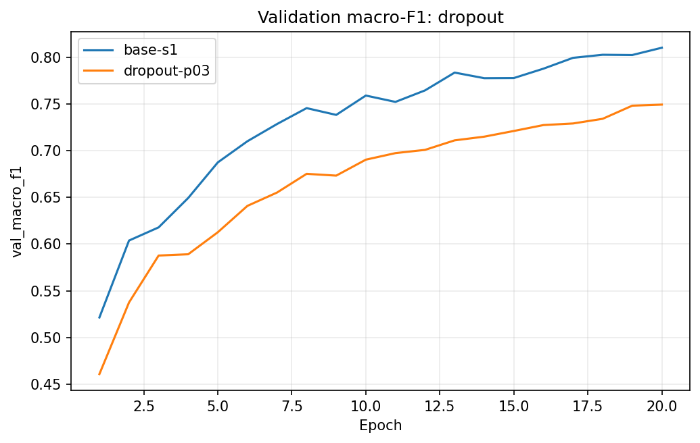
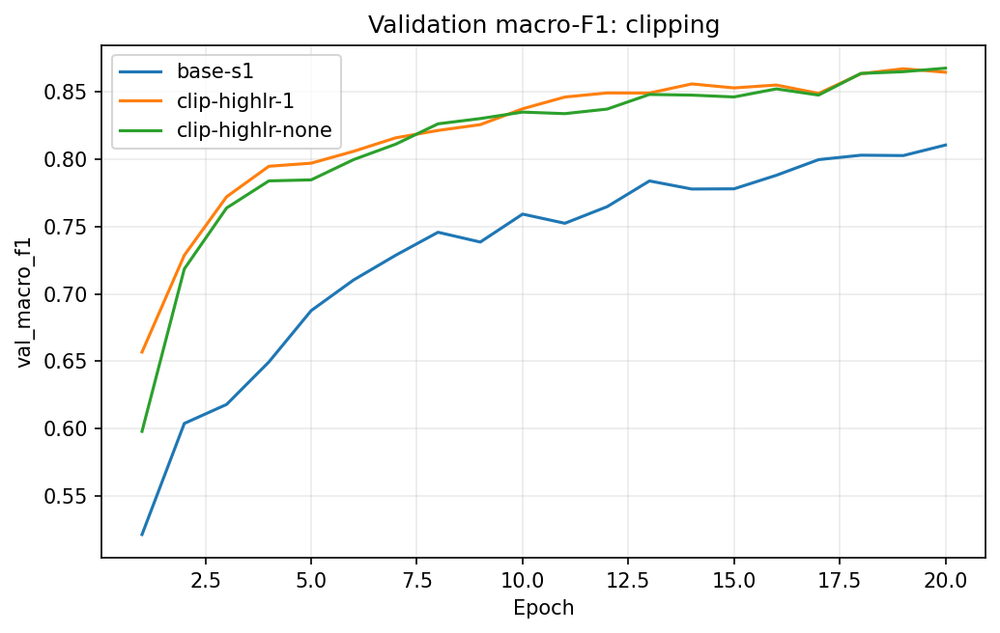
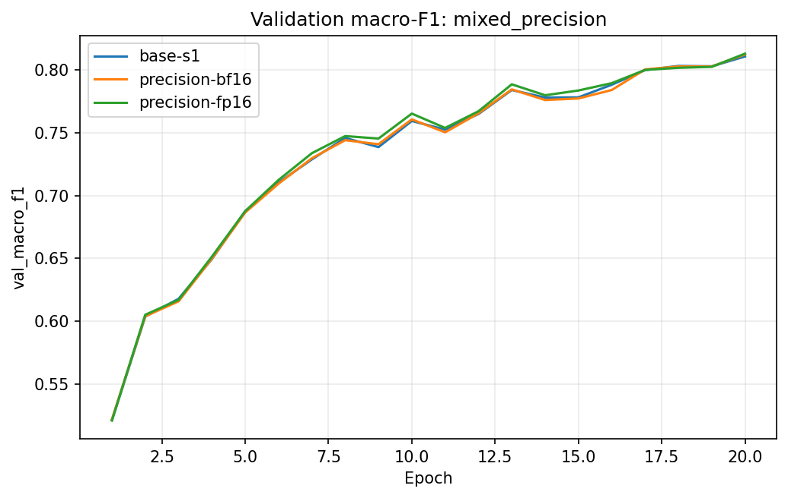
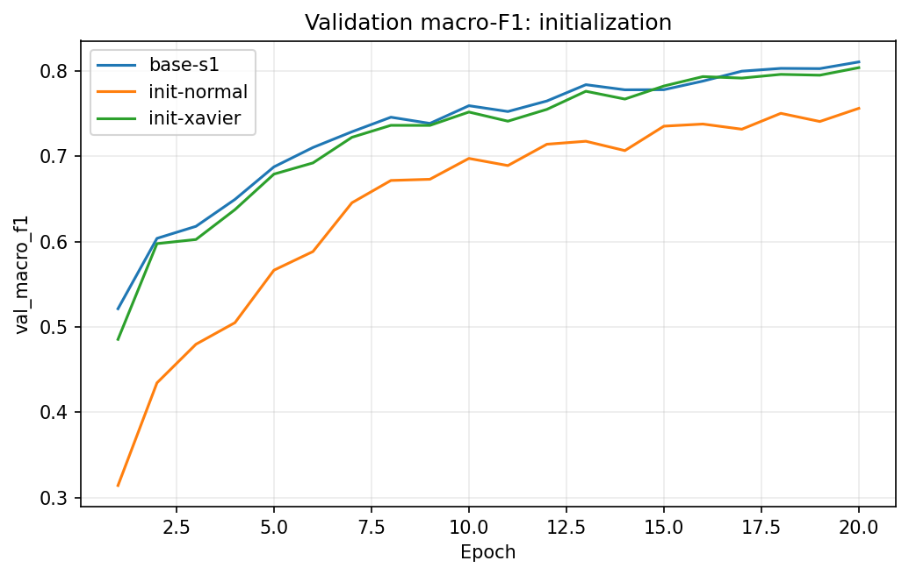
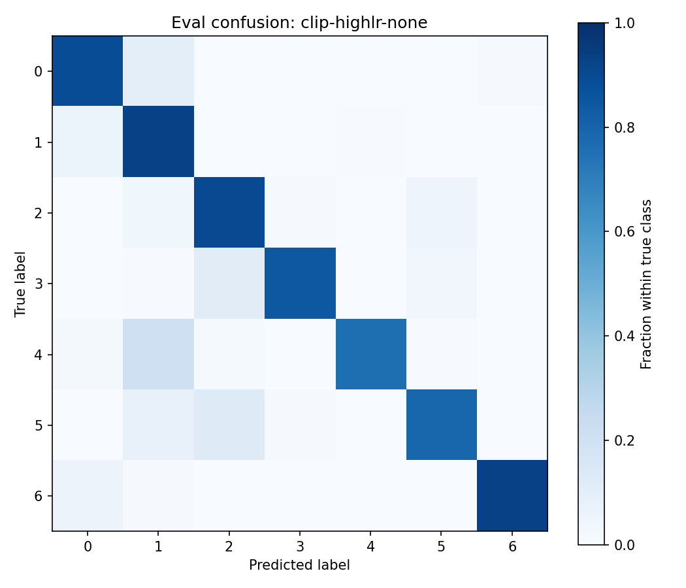

# Báo cáo Lab Day 1 — Hoàng Trung Anh — 2A202602521

## 1. Thiết lập
Google Colab, Tesla T4, PyTorch 2.11.0+cu130. M-base 54→256→128→7, 47 879 tham số. Chuẩn hoá 10 cột số chỉ bằng train; 44 cột nhị phân giữ nguyên.
Train/eval theo metadata: 464 809/116 203. Validation phân tầng 20%, seed 42: 371 847 train, 92 962 val. Accuracy đoán lớp đa số: 0.4876.
Baseline: CE, AdamW, lr=0.001, batch=2048, 20 epoch, He, FP32, không dropout/weight decay/clipping. Batch cuối nhỏ hơn được giữ lại. Mọi thí nghiệm cùng số bước mỗi epoch.

## 2. Kiểm tra ban đầu và độ nhiễu
Logits: [20, 7]; gradient khác 0 ở mọi tensor tham số: True. Overfit 20 mẫu, 500 bước Adam lr=0.01: loss=0.000004.
Step-0 CE baseline: 2.269062; ln(7)=1.945910. He có logits ngẫu nhiên với phương sai khác 0 nên CE có thể cao hơn ln(7).
Baseline 3 seed: val macro-F1=0.810574 ± 0.002258; ngưỡng 2σ=0.004517 (độ lệch chuẩn mẫu).

## 3. Kết quả theo chủ đề
| exp_id | lr | val acc | val macro-F1 | epoch tốt nhất | giây/epoch |
|---|---:|---:|---:|---:|---:|
| base-s1 | 0.001 | 0.883931 | 0.810539 | 20 | 0.4267 |
| base-s2 | 0.001 | 0.884587 | 0.812849 | 20 | 0.4248 |
| base-s3 | 0.001 | 0.880349 | 0.808333 | 20 | 0.3980 |
| clip-highlr-1 | 0.01 | 0.910759 | 0.867188 | 19 | 0.4381 |
| clip-highlr-none | 0.01 | 0.907392 | 0.867610 | 20 | 0.4220 |
| dropout-p03 | 0.001 | 0.849594 | 0.749552 | 20 | 0.4236 |
| init-normal | 0.001 | 0.845700 | 0.756177 | 20 | 0.4281 |
| init-xavier | 0.001 | 0.878284 | 0.803825 | 20 | 0.4112 |
| loss-mse | 0.001 | 0.874347 | 0.759020 | 20 | 0.4262 |
| lr-adamw-3e4 | 0.0003 | 0.845840 | 0.734792 | 20 | 0.4171 |
| opt-adam-lr1e3 | 0.001 | 0.883931 | 0.810539 | 20 | 0.4230 |
| opt-adam-lr3e4 | 0.0003 | 0.845840 | 0.734792 | 20 | 0.4099 |
| opt-sgdm-lr01 | 0.01 | 0.815946 | 0.661602 | 20 | 0.3874 |
| opt-sgdm-lr05 | 0.05 | 0.869742 | 0.766245 | 19 | 0.3706 |
| precision-bf16 | 0.001 | 0.884695 | 0.812117 | 20 | 0.4716 |
| precision-fp16 | 0.001 | 0.884544 | 0.812779 | 20 | 0.5497 |

### loss
CE tối ưu xác suất lớp qua softmax; MSE ở đây lấy trung bình bình phương lỗi giữa logits thô và one-hot, không phải giữa xác suất và one-hot. Hai thang loss khác nhau; chỉ so accuracy/F1.
Tốt nhất nhóm: `loss-mse`, ΔF1 so base-s1=-0.051518; |Δ| vượt ngưỡng 2σ baseline. Chỉ baseline được lặp seed nên đây là so sánh thăm dò.

### optimizer
SGD momentum và Adam được thử hai learning rate. AdamW với weight_decay=0 tương đương Adam; đây không phải bằng chứng cho lợi ích của decoupled weight decay.
Tốt nhất nhóm: `opt-adam-lr1e3`, ΔF1 so base-s1=+0.000000; |Δ| chưa vượt ngưỡng 2σ baseline. Chỉ baseline được lặp seed nên đây là so sánh thăm dò.

### hyperparameter
Learning rate nhỏ có thể hội tụ chậm trong ngân sách 20 epoch. Kết luận chỉ đúng trong lưới lr đã thử.
Tốt nhất nhóm: `lr-adamw-3e4`, ΔF1 so base-s1=-0.075747; |Δ| vượt ngưỡng 2σ baseline. Chỉ baseline được lặp seed nên đây là so sánh thăm dò.

### dropout
Dropout p=0.3 thêm nhiễu và giảm năng lực học. Nếu baseline chưa quá khớp mạnh, dropout có thể làm giảm F1 trong cùng ngân sách.
Tốt nhất nhóm: `dropout-p03`, ΔF1 so base-s1=-0.060986; |Δ| vượt ngưỡng 2σ baseline. Chỉ baseline được lặp seed nên đây là so sánh thăm dò.

### clipping
So sánh lr=0.01 có/không clip norm=1. Grad norm ghi trước clip. Không kết luận clipping cứu phân kỳ nếu cả hai đều hội tụ; trung bình grad norm không cho biết chính xác tỷ lệ batch kích hoạt clip.
Tốt nhất nhóm: `clip-highlr-none`, ΔF1 so base-s1=+0.057072; |Δ| vượt ngưỡng 2σ baseline. Chỉ baseline được lặp seed nên đây là so sánh thăm dò.

### mixed_precision
T4 không hỗ trợ BF16 native; PyTorch có thể thực thi BF16 qua fallback/emulation. FP16 dùng GradScaler, unscale trước khi đo/clip gradient. Thời gian còn gồm đánh giá FP32 toàn train/val; tốc độ mạng nhỏ có thể bị giới hạn bởi overhead.
Tốt nhất nhóm: `precision-fp16`, ΔF1 so base-s1=+0.002240; |Δ| chưa vượt ngưỡng 2σ baseline. Chỉ baseline được lặp seed nên đây là so sánh thăm dò.

### initialization
He giữ phương sai phù hợp ReLU, Xavier cân bằng fan-in/fan-out; normal 0.01 có thể giảm tín hiệu. Zeros phá đối xứng và chặn gradient qua các hidden layer, không phải khởi tạo phù hợp.
Tốt nhất nhóm: `init-xavier`, ΔF1 so base-s1=-0.006713; |Δ| vượt ngưỡng 2σ baseline. Chỉ baseline được lặp seed nên đây là so sánh thăm dò.

## 4. Đánh giá cuối trên eval
Chọn `clip-highlr-none` bằng macro-F1 validation trước khi xem eval; checkpoint chọn bằng val loss thấp nhất. Sau đó chạy scripts/evaluate.py cho baseline và cấu hình cuối.
| Cấu hình | eval accuracy | eval macro-F1 |
|---|---:|---:|
| base-s1 | 0.883557 | 0.811877 |
| clip-highlr-none | 0.906767 | 0.869542 |

| Lớp | Support | Precision | Recall | F1 |
|---|---:|---:|---:|---:|
| 0 | 42368 | 0.912014 | 0.890295 | 0.901024 |
| 1 | 56661 | 0.909957 | 0.930658 | 0.920191 |
| 2 | 7151 | 0.909386 | 0.900993 | 0.905170 |
| 3 | 549 | 0.839350 | 0.846995 | 0.843155 |
| 4 | 1899 | 0.805137 | 0.759347 | 0.781572 |
| 5 | 3473 | 0.845253 | 0.789519 | 0.816436 |
| 6 | 4102 | 0.906398 | 0.932472 | 0.919250 |
Lớp khó nhất: 4 (F1=0.781572), nhầm nhiều nhất sang lớp 1. Mất cân bằng và vùng đặc trưng chồng lấn là giả thuyết, chưa kiểm chứng; có thể thử weighted CE bằng validation.

## 5. Câu hỏi dẫn dắt
1. Chọn bộ tối ưu qua bảng ở lr tốt nhất trong lưới đã thử; lr chưa chỉnh có thể đảo thứ hạng. Lưới nhỏ và AdamW wd=0 giới hạn kết luận.
2. Dropout chỉ nên thêm khi train–val gap và độ nhiễu cho thấy overfit; chưa overfit thì regularization có thể làm underfit.
3. Clipping giới hạn chuẩn gradient để giảm bước cập nhật quá lớn; phải đối chiếu grad norm và đường loss, không suy luận từ F1 một mình.
4. So precision-fp16 với base-s1 trong bảng: thời gian gồm overhead và đánh giá FP32, nên mixed precision không đảm bảo nhanh hơn cho MLP nhỏ.
5. Zeros làm neuron đối xứng và gradient hidden không học được; He dùng phương sai 2/fan_in cho ReLU, Xavier dùng 2/(fan_in+fan_out).
6. Nếu loss không giảm sau 2 000 bước: kiểm tra nhãn/dtype/shape và CE dùng logits; kiểm tra gradient, zero_grad/backward/step và scale đầu vào; thử overfit 20 mẫu rồi quét lr. Ba bước tách lỗi dữ liệu, lỗi cập nhật và lỗi cấu hình.

## 6. Hạn chế
Ba seed chỉ đo nhiễu baseline, chưa đo nhiễu từng cấu hình. Lặp baseline/final cùng seed để lấy trọng số cho eval và ghi lại kết quả thực tế; GPU có thể không bitwise deterministic. Không có weight decay khác 0, lưới lr nhỏ, không khảo sát độ rộng/độ sâu. Các giải thích lý thuyết được bổ sung sau lượt chạy đầu, không phải bản dự đoán được ghi trước thí nghiệm.
Chỉ có một seed eval mỗi cấu hình nên không khẳng định cải thiện eval có ý nghĩa thống kê. Ngưỡng nhiễu validation chỉ là tham chiếu.

## 7. Phụ lục
`peak_mem_MB` đo tổng bộ nhớ PyTorch đang cấp phát, gồm dữ liệu và các đối tượng còn giữ trong kernel. Khi lặp baseline/final để khôi phục trọng số, còn bộ dữ liệu của lượt trước nên peak cao hơn. Không dùng các số peak này để kết luận mixed precision tiết kiệm bộ nhớ; cần đo lại ở các kernel tách biệt.

Code, notebook, experiments.xlsx, predictions_eval.csv, eval_result.json, figures và results. predictions_baseline.csv/eval_baseline.json giữ để đối chiếu. Không nộp dữ liệu hoặc trọng số.
