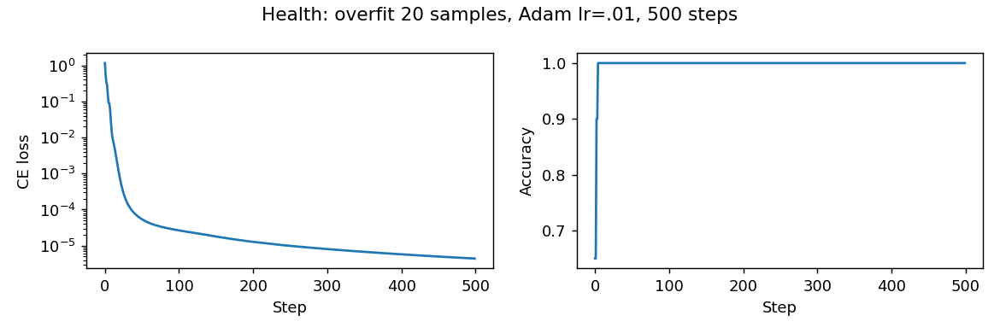
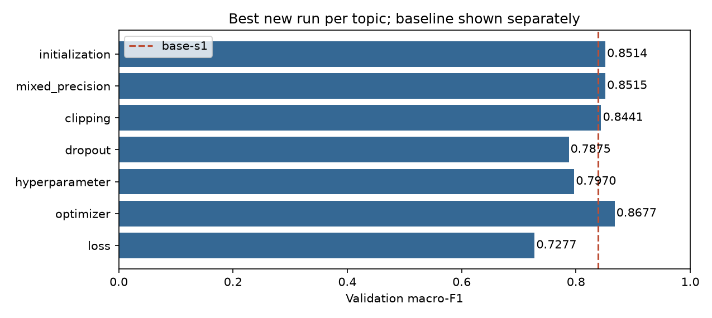

# Báo cáo Lab Day 1 — Hoàng Trung Anh — 2A202602521

## 1. Thiết lập

Colab Tesla T4, PyTorch 2.11.0+cu130. M-base 54→256→128→7, 47 879 tham số, ReLU, logits thô. Metadata train/eval 464 809/116 203; validation 20%, stratify seed 42: 371 847 train/92 962 val. Chuẩn hoá 10 cột từ train; giữ 44 cột nhị phân. Majority val accuracy=0.487597.

Baseline đúng GUIDE: SGD momentum 0,9, lr=0.1, batch 512, 20 epoch, CE, He, FP32; không dropout/clip/weight decay. Lr chọn từ 0.01/0.05/0.1 bằng val. Mỗi run khởi chạy process GPU độc lập; batch cuối giữ lại. Adam/AdamW thử 0.0003/0.001/0.003. Đã thử đủ 7 chủ đề. Mọi số liệu có trong Experiments/Seeds/Summary, tra theo exp_id; cấu hình và giả thuyết ghi trước trong protocol.json/planned/.

## 2. Kiểm tra ban đầu và độ nhiễu

Logits (20,7); gradient khác 0 ở mọi tham số. Overfit 20 mẫu: accuracy=1.000000, loss=0.00000439 sau 500 bước Adam lr=.01. Loss uniform logits=1.945910=ln 7. He step-0 CE=2.269062; logits ngẫu nhiên có phương sai nên CE không bằng uniform. Kiểm tra dtype, chuẩn hoá, gradient và overfit đều qua trước khi chạy dài.

Baseline seed 1–3: val acc=0.908156 ± 0.002444; macro-F1=0.853510 ± 0.012555; 2σ=0.025110 (std mẫu). Gap loss cuối base-s1=0.021700, best epoch=18; train/val loss giảm mạnh lúc đầu rồi giảm chậm, có dao động và val tăng nhẹ sau cực tiểu ở epoch 18. Gap cuối nhỏ, chưa có bằng chứng overfit mạnh. Ngưỡng này là tham chiếu, không phải kiểm định thống kê cho từng cấu hình một seed.

## 3. Kết quả theo chủ đề

Các dự đoán sau được lưu trước run mới. So sánh dùng metric tại epoch có val loss thấp nhất; mỗi run có PNG loss/metric/gradient riêng. Hình tổng hợp bên dưới và compare_<nhóm>.png đối chiếu các đường.

**Loss.** Dự đoán CE phù hợp phân lớp hơn MSE logits/one-hot. `loss-mse` F1=0.727665, Δ so `base-s1`=-0.111370 (vượt 2σ tham chiếu). MSE lấy mean trên B×7, không có hệ số 1/2; khác thang CE nên không so loss trực tiếp. CE liên hệ gradient với xác suất lớp; kết quả chỉ đúng lr/ngân sách đã thử.

**Optimizer.** Dự đoán Adam thích nghi bước nên có thể hội tụ nhanh hơn. `adam-lr0.003` F1=0.867747, Δ so `base-s1`=+0.028711 (vượt 2σ tham chiếu). SGD có 3 lr và Adam/AdamW có 3 lr; phải so mỗi bộ ở lr tốt nhất, không so một lr bất kỳ. Adam và AdamW wd=0 tương đương, không đo lợi ích decoupled decay.

**Hyper-parameter.** Dự đoán batch lớn học chậm nếu giữ lr. `batch2048` F1=0.796963, Δ so `base-s1`=-0.042073 (vượt 2σ tham chiếu). Batch 512/2048 tương ứng 727/182 update mỗi epoch; cùng epoch không cùng số update. Đây là thay batch duy nhất, không tự tăng lr.

**Dropout.** Dự đoán giảm gap nhưng có thể underfit. `dropout-p03` F1=0.787488, Δ so `base-s1`=-0.051548 (vượt 2σ tham chiếu). Gap cuối p=.3/base=0.006482/0.021700; xem cả train và val loss trong dòng tương ứng, gap nhỏ tự nó không chứng minh khái quát hoá tốt.

**Clipping.** Dự đoán hạn chế gradient cực lớn, không chắc cứu được lr cao. c=0.696241 từ phân vị 90 grad batch baseline, lr cao=1.0. Clip thường: tỷ lệ batch clip=0.133356; clip lr cao=0.001032. Cặp cùng lr: `highlr-clip` F1=0.802702 vs `highlr-none` F1=0.773175; diverged=False/False. Cặp lr cao khác baseline cả lr/clip; không quy mọi cải thiện cho clipping. Grad đo trước clip.

**Mixed precision.** Dự đoán overhead MLP nhỏ có thể xoá lợi ích Tensor Core. `precision-fp16` F1=0.851504, Δ so `base-s1`=+0.012468 (chưa vượt 2σ tham chiếu). Thời gian FP32/FP16/BF16=1.3089/1.7472/1.5482 s/epoch; peak=160.59/160.59/160.59 MB. Process độc lập, cùng dữ liệu; peak gồm data/model/optimizer, không riêng activation. BF16 native=False; FP16 cần scaler do miền số hẹp, unscale trước clip. Thời gian gồm đánh giá FP32 toàn train/val. FP16 có gradient mean không hữu hạn ở một số epoch (notes/JSON ghi null và epoch cụ thể), loss vẫn hữu hạn; GradScaler bỏ các cập nhật overflow. Khoảng trống trên đường gradient phản ánh giá trị thiếu, không phải gradient bằng 0.

**Init.** Dự đoán He giữ tín hiệu ReLU, normal nhỏ giảm tín hiệu, zeros không phá đối xứng. `init-xavier` F1=0.851434, Δ so `base-s1`=+0.012399 (chưa vượt 2σ tham chiếu). Std sau mỗi ReLU trên 2 048 mẫu val và step-0 CE lưu Summary/health_checks.json. Zeros cho hidden activation=0 và chỉ bias đầu ra có thể học prior; lớp ẩn không học qua ReLU(0). He var=2/fan_in, Xavier var=2/(fan_in+fan_out). Mạng hai lớp ẩn chưa đại diện mạng rất sâu.

Ảnh riêng theo chủ đề: [loss](figures/compare_loss.png), [optimizer](figures/compare_optimizer.png), [hyperparameter](figures/compare_hyperparameter.png), [dropout](figures/compare_dropout.png), [clipping](figures/compare_clipping.png), [mixed_precision](figures/compare_mixed_precision.png), [initialization](figures/compare_initialization.png).

| Bộ tối ưu | exp_id tốt nhất trong lưới | lr | val F1 | best epoch |
|---|---|---:|---:|---:|
| sgd_momentum | base-s1 | 0.1 | 0.839036 | 18 |
| adam | adam-lr0.003 | 0.003 | 0.867747 | 19 |
| adamw | adamw-lr0.003 | 0.003 | 0.867747 | 19 |

Đối chiếu giả thuyết: MSE thấp hơn CE, khớp dự đoán; batch2048 thấp hơn, khớp dự đoán học chậm. Mixed precision không nhanh hơn FP32 theo số đo, không mặc định tăng tốc. Các Δ nhỏ hơn 2σ chưa đủ phân biệt nhiễu; cấu hình final có lặp seed nhưng các chủ đề khác vẫn thăm dò.

## 4. Đánh giá cuối và lỗi theo lớp

Khoá `adam-lr0.003` bằng F1 val trước scoring mới, seed nộp=1; không đổi sau eval. Cfg=adam, lr=0.003, batch=512, init=he, dropout=0.0, clip=None, precision=fp32. Checkpoint min val loss.

| exp_id | val F1 | eval accuracy | eval F1 |
|---|---:|---:|---:|
| base-s1 | 0.839036 | 0.903342 | 0.840992 |
| adam-lr0.003 | 0.867747 | 0.914030 | 0.869999 |

Final eval seed 1–3 F1=0.868871 ± 0.003280. Seed 1 Δeval vs baseline=+0.029007; eval−val=+0.002253. Baseline eval một seed nên chưa có kiểm định hai nhóm; nhiễu val không thay được nhiễu eval.

| Lớp | support | precision | recall | F1 |
|---|---:|---:|---:|---:|
| 0 | 42368 | 0.928322 | 0.889539 | 0.908517 |
| 1 | 56661 | 0.911887 | 0.946489 | 0.928866 |
| 2 | 7151 | 0.930030 | 0.879178 | 0.903889 |
| 3 | 549 | 0.714906 | 0.899818 | 0.796774 |
| 4 | 1899 | 0.829680 | 0.777251 | 0.802610 |
| 5 | 3473 | 0.807828 | 0.855744 | 0.831096 |
| 6 | 4102 | 0.943887 | 0.893954 | 0.918242 |

Lớp khó nhất 3 (F1=0.796774), nhầm nhiều nhất sang 2; support=549. Mất cân bằng và tương đồng địa hình có thể giải thích nhưng chưa có kiểm chứng feature. Có thể thử weighted CE bằng val ở nghiên cứu sau.

## 5. Câu hỏi dẫn dắt

1. Optimizer tốt nhất phụ thuộc lưới lr; so lr tốt nhất của mỗi bộ trong Experiments, không suy rộng ngoài lưới. Adam thích nghi bước, SGD momentum tích luỹ hướng gradient.

2. Dùng dropout khi có bằng chứng train giảm nhưng val tăng; khi chưa overfit, nó có thể làm underfit (mục 3).

3. Clipping giới hạn chuẩn gradient, không sửa nhãn hay lr bất kỳ; bằng chứng là clip fraction và cặp cùng lr ở mục 3, kể cả trường hợp không cứu được phân kỳ.

4. Mixed precision chỉ nhanh hơn nếu số đo thời gian ở mục 3 nhỏ hơn FP32; data resident, kernel overhead, optimizer và evaluation FP32 có thể chi phối mạng nhỏ.

5. Zeros giữ đối xứng và ReLU(0) chặn gradient hidden; He bù phương sai bị ReLU cắt, Xavier cân bằng fan-in/fan-out.

6. Loss không giảm sau 2 000 bước: (i) kiểm tra nhãn 0..6, dtype/shape và CE trên logits; (ii) kiểm tra chuẩn hoá, gradient và zero_grad/backward/step; (iii) overfit 20 mẫu rồi quét lr trên val. Các phép kiểm tra lần lượt tách lỗi dữ liệu, cập nhật và cấu hình.

## 6. Hạn chế và điều bất ngờ

Đây là lượt sửa tuân thủ đề sau khi đã biết eval cũ. Lưới và giả thuyết mới được khoá trước run, không chọn theo eval mới, nhưng không thể coi eval hoàn toàn chưa từng được xem. Giữ lịch sử cũ trong Git; không giả mạo dự đoán trước của lượt cũ. Chỉ baseline/final lặp 3 seed; các chủ đề khác một seed. Kết quả khác giả thuyết cần diễn giải theo số quan sát, không coi lý thuyết là kết quả đo. BF16 emulation và thời gian có nhiễu hệ thống; không thử weight_decay, width/depth vì menu là tuỳ chọn.

## 7. Phụ lục

Tổng thời gian epoch đã ghi=685.40 s, không gồm khởi tạo process, health, vẽ và scoring. Nộp REPORT.md, experiments.xlsx, predictions/eval JSON, code/lab.ipynb và modules, figures, results, protocol.json/planned. Toàn bộ code trong code; không nộp dữ liệu/cache/checkpoint. Notebook giữ output; mở từ submission/code, đọc data ở ../../data và ghi figures/results ở ../. Công thức Excel tính lại khi mở; bản giao đã được recalculation và kiểm tra.